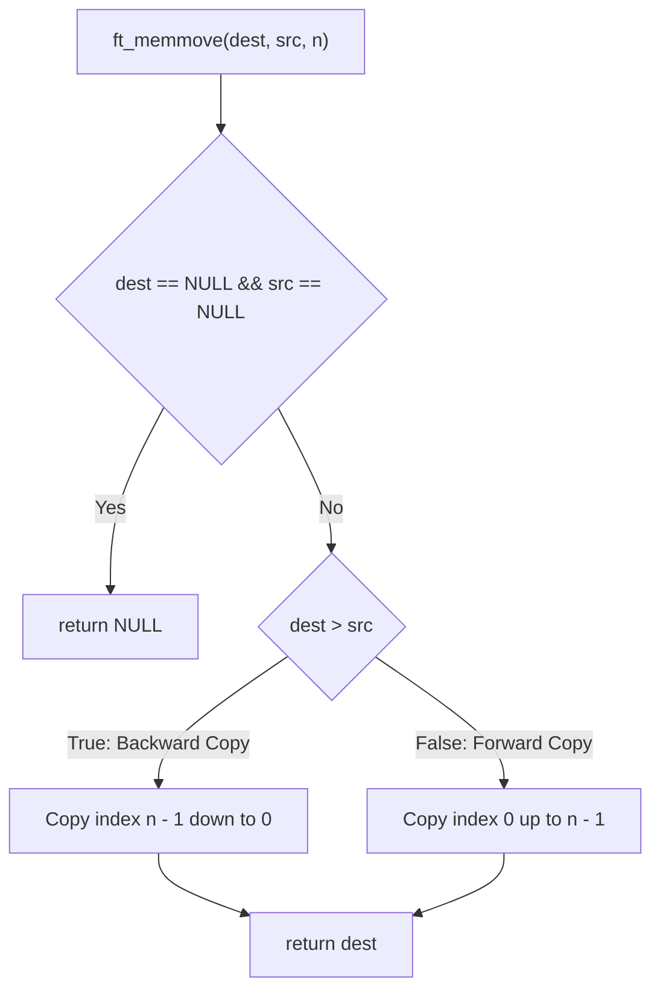
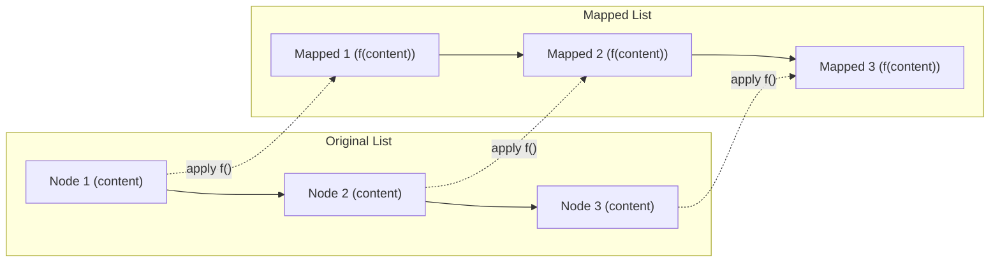

*This project has been created as part of the 42 curriculum by ahsimsek.*

# Libft

## Description
Libft is the foundational systems programming project of the 42 curriculum. The objective is to recreate a core subset of the standard C library (`libc`) alongside essential utility routines, memory management functions, and linked list data structures from first principles.

Because standard library headers such as `<string.h>` and `<stdlib.h>` are restricted in subsequent 42 assignments, Libft serves as the portable, reusable static library (`libft.a`) that powers downstream systems projects. All implementations comply with the ANSI C (C99) standard, enforce strict pointer validity checks, prevent memory leaks, and adhere to 42 Norminette coding constraints.

---

## Instructions

### Compilation
The project is built using a Makefile configured with the required compiler flags (`-Wall -Wextra -Werror`). To compile all source files and generate the static library:

```bash
make
```

The build system compiles each `.c` source file into an object file (`.o`) and archives them into `libft.a` using `ar rcs`.

Available Makefile rules:
- `make all`: Compiles the full library (`libft.a`).
- `make clean`: Deletes intermediate object files (`.o`).
- `make fclean`: Deletes object files and the static library binary (`libft.a`).
- `make re`: Recompiles the library from scratch.

### Linking with a C Project
To use the compiled library in a program, include `libft.h` in the C source file and pass the library path to the compiler:

```c
#include "libft.h"

int	main(void)
{
	char	*str;

	str = ft_strdup("42 Network");
	if (!str)
		return (1);
	ft_putendl_fd(str, 1);
	free(str);
	return (0);
}
```

Compile and link using `cc`:

```bash
cc -Wall -Wextra -Werror main.c -L. -lft -o program
```

---

## Library Specification

### 1. Standard Libc Functions

| Function | Prototype | Description |
| :--- | :--- | :--- |
| `ft_isalpha` | `int ft_isalpha(int c);` | Tests whether `c` is an alphabetic character (`A`-`Z`, `a`-`z`). |
| `ft_isdigit` | `int ft_isdigit(int c);` | Tests whether `c` is an ASCII decimal digit (`0`-`9`). |
| `ft_isalnum` | `int ft_isalnum(int c);` | Tests whether `c` is alphanumeric. |
| `ft_isascii` | `int ft_isascii(int c);` | Tests whether `c` is a 7-bit unsigned char value fitting ASCII. |
| `ft_isprint` | `int ft_isprint(int c);` | Tests whether `c` is any printable character including space. |
| `ft_strlen` | `size_t ft_strlen(const char *s);` | Computes the length of string `s` excluding the null terminator. |
| `ft_memset` | `void *ft_memset(void *s, int c, size_t n);` | Fills the first `n` bytes of memory area `s` with byte `c`. |
| `ft_bzero` | `void ft_bzero(void *s, size_t n);` | Erases `n` bytes starting at `s` by writing zero bytes (`\0`). |
| `ft_memcpy` | `void *ft_memcpy(void *dest, const void *src, size_t n);` | Copies `n` bytes from `src` to `dest`. Memory areas must not overlap. |
| `ft_memmove` | `void *ft_memmove(void *dest, const void *src, size_t n);` | Copies `n` bytes from `src` to `dest` safely when memory areas overlap. |
| `ft_strlcpy` | `size_t ft_strlcpy(char *dst, const char *src, size_t size);` | Copies up to `size - 1` characters from `src` to `dst`, null-terminating. |
| `ft_strlcat` | `size_t ft_strlcat(char *dst, const char *src, size_t size);` | Appends `src` to `dst`, ensuring total buffer length does not exceed `size`. |
| `ft_toupper` | `int ft_toupper(int c);` | Converts a lowercase letter to uppercase. |
| `ft_tolower` | `int ft_tolower(int c);` | Converts an uppercase letter to lowercase. |
| `ft_strchr` | `char *ft_strchr(const char *s, int c);` | Locates the first occurrence of `c` in string `s`. |
| `ft_strrchr` | `char *ft_strrchr(const char *s, int c);` | Locates the last occurrence of `c` in string `s`. |
| `ft_strncmp` | `int ft_strncmp(const char *s1, const char *s2, size_t n);` | Compares at most `n` bytes of `s1` and `s2`. |
| `ft_memchr` | `void *ft_memchr(const void *s, int c, size_t n);` | Scans initial `n` bytes of `s` for byte `c`. |
| `ft_memcmp` | `int ft_memcmp(const void *s1, const void *s2, size_t n);` | Compares initial `n` bytes of two memory areas. |
| `ft_strnstr` | `char *ft_strnstr(const char *big, const char *little, size_t len);` | Locates substring `little` within first `len` bytes of `big`. |
| `ft_atoi` | `int ft_atoi(const char *nptr);` | Converts initial portion of string `nptr` to integer. |
| `ft_calloc` | `void *ft_calloc(size_t nmemb, size_t size);` | Allocates memory for array of elements initialized to zero. |
| `ft_strdup` | `char *ft_strdup(const char *s);` | Duplicates string `s` using dynamic memory allocation. |

### 2. Additional Utility Functions

| Function | Prototype | Description |
| :--- | :--- | :--- |
| `ft_substr` | `char *ft_substr(char const *s, unsigned int start, size_t len);` | Allocates and returns substring from `s` starting at index `start`. |
| `ft_strjoin` | `char *ft_strjoin(char const *s1, char const *s2);` | Concatenates `s1` and `s2` into a newly allocated string. |
| `ft_strtrim` | `char *ft_strtrim(char const *s1, char const *set);` | Trims leading and trailing characters matching `set` from `s1`. |
| `ft_split` | `char **ft_split(char const *s, char c);` | Splits string `s` into an array of strings using delimiter `c`. |
| `ft_itoa` | `char *ft_itoa(int n);` | Generates a null-terminated string representing the integer `n`. |
| `ft_strmapi` | `char *ft_strmapi(char const *s, char (*f)(unsigned int, char));` | Creates a new string by applying `f` to each character of `s`. |
| `ft_striteri` | `void ft_striteri(char *s, void (*f)(unsigned int, char*));` | Applies `f` in-place to each character of string `s`. |
| `ft_putchar_fd` | `void ft_putchar_fd(char c, int fd);` | Writes character `c` to specified file descriptor `fd`. |
| `ft_putstr_fd` | `void ft_putstr_fd(char *s, int fd);` | Writes string `s` to specified file descriptor `fd`. |
| `ft_putendl_fd` | `void ft_putendl_fd(char *s, int fd);` | Writes string `s` followed by newline to file descriptor `fd`. |
| `ft_putnbr_fd` | `void ft_putnbr_fd(int n, int fd);` | Writes integer `n` to specified file descriptor `fd`. |

### 3. Linked List Primitives

```c
typedef struct s_list
{
	void			*content;
	struct s_list	*next;
}	t_list;
```

| Function | Prototype | Description |
| :--- | :--- | :--- |
| `ft_lstnew` | `t_list *ft_lstnew(void *content);` | Allocates a new node with `content` and sets `next` to `NULL`. |
| `ft_lstadd_front` | `void ft_lstadd_front(t_list **lst, t_list *new);` | Prepends node `new` to head of list `lst`. |
| `ft_lstsize` | `int ft_lstsize(t_list *lst);` | Counts total number of nodes in list `lst`. |
| `ft_lstlast` | `t_list *ft_lstlast(t_list *lst);` | Returns pointer to final node in list `lst`. |
| `ft_lstadd_back` | `void ft_lstadd_back(t_list **lst, t_list *new);` | Appends node `new` to end of list `lst`. |
| `ft_lstdelone` | `void ft_lstdelone(t_list *lst, void (*del)(void *));` | Deallocates memory of single node using `del` function. |
| `ft_lstclear` | `void ft_lstclear(t_list **lst, void (*del)(void *));` | Deallocates and clears entire list starting from `*lst`. |
| `ft_lstiter` | `void ft_lstiter(t_list *lst, void (*f)(void *));` | Iterates over list, calling function `f` on each node's content. |
| `ft_lstmap` | `t_list *ft_lstmap(t_list *lst, void *(*f)(void *), void (*del)(void *));` | Creates a new list by applying `f` across all nodes with clean error rollback. |

---

## Algorithm and Data Structure

### 1. Memory Boundaries and Overlap Resolution

The C memory model permits distinct buffers to overlap within the same contiguous address space. When copying $N$ bytes from source address $S$ to destination address $D$, two conditions arise:

```text
Case 1: No overlap or Destination precedes Source (D <= S)
Memory: [ D (dest) ... ] [ S (source) ... ]
Copy Direction: Forward (0 to N - 1)

Case 2: Overlapping memory with Destination higher than Source (D > S)
Memory: [ S (source) ... [ D (dest) ... ] ... ]
Copy Direction: Backward (N - 1 down to 0)
```

In `ft_memcpy`, forward copying is executed unconditionally. If $D > S$ and $D < S + N$, forward copying overwrites source bytes before they are read, corrupting data.

`ft_memmove` resolves this via directional pointer arithmetic:

```c
void	*ft_memmove(void *dest, const void *src, size_t n)
{
	unsigned char		*d;
	const unsigned char	*s;
	size_t				i;

	if (!dest && !src)
		return (NULL);
	d = (unsigned char *)dest;
	s = (const unsigned char *)src;
	if (d > s)
	{
		i = n;
		while (i > 0)
		{
			i--;
			d[i] = s[i];
		}
	}
	else
	{
		i = 0;
		while (i < n)
		{
			d[i] = s[i];
			i++;
		}
	}
	return (dest);
}
```



---

### 2. Allocation Safety and Multi-Word Unwinding

Dynamic memory management in C requires handling allocation failures without leaking memory. Two critical functions illustrate these safety guarantees:

#### Integer Overflow Guard in `ft_calloc`
When allocating an array of $M$ elements of size $S$, calculating total bytes as $M \times S$ can wrap around if the product exceeds `SIZE_MAX`. `ft_calloc` verifies this boundary:

$$S \ne 0 \quad \text{and} \quad M > \frac{C_{\max}}{S}$$

where $C_{\max}$ corresponds to `SIZE_MAX` (the maximum representable value of `size_t`).

#### Unwind Cleanup in `ft_split`
`ft_split` allocates a dynamic array of strings (`char **`). If allocation fails midway through processing word $k$, all previously allocated words from index $0$ to $k - 1$ must be individually freed before freeing the top-level pointer:

```c
static char	**free_split(char **tab, size_t count)
{
	size_t	i;

	i = 0;
	while (i < count)
	{
		free(tab[i]);
		i++;
	}
	free(tab);
	return (NULL);
}
```

This pattern ensures that every branch either returns a fully allocated matrix or exits with zero residual heap allocations.

---

### 3. Linked List Mechanics and Functional Mapping

The singly linked list implementation stores dynamic values behind a generic pointer (`void *`). This separates node linking logic from content payloads.

`ft_lstmap` demonstrates functional mapping over a recursive data structure:



If memory allocation fails for any new node during iteration, `ft_lstclear` is executed on the partial new list using the caller's deletion function `del`. This leaves the original list untouched while reclaiming all newly allocated nodes.

---

### 4. Complexity Analysis

| Category | Typical Functions | Time Complexity | Auxiliary Space Complexity | Notes |
| :--- | :--- | :---: | :---: | :--- |
| **Character Checks** | `ft_isalpha`, `ft_isdigit`, `ft_isalnum` | $\mathcal{O}(1)$ | $\mathcal{O}(1)$ | Bitwise evaluation or direct lookup table. |
| **Byte Memory** | `ft_memset`, `ft_memcpy`, `ft_memmove` | $\mathcal{O}(N)$ | $\mathcal{O}(1)$ | Linear scan over $N$ bytes. |
| **String Search** | `ft_strlen`, `ft_strchr`, `ft_strncmp` | $\mathcal{O}(N)$ | $\mathcal{O}(1)$ | Sequential scan up to null terminator or limit. |
| **Substring Search** | `ft_strnstr` | $\mathcal{O}(N \cdot M)$ | $\mathcal{O}(1)$ | Needle search of length $M$ in haystack of length $N$. |
| **String Allocation** | `ft_substr`, `ft_strjoin`, `ft_strtrim` | $\mathcal{O}(N)$ | $\mathcal{O}(N)$ | Allocates single new buffer of length $N$. |
| **Array Splitting** | `ft_split` | $\mathcal{O}(N)$ | $\mathcal{O}(N)$ | Two linear passes: word count and word extraction. |
| **List Traversal** | `ft_lstsize`, `ft_lstlast`, `ft_lstiter` | $\mathcal{O}(N)$ | $\mathcal{O}(1)$ | Single pass over $N$ linked nodes. |
| **List Transformation**| `ft_lstmap` | $\mathcal{O}(N)$ | $\mathcal{O}(N)$ | Allocates $N$ wrapper nodes plus transformed payloads. |

---

## Resources

### Classic References
- **Kernighan, Brian W., and Dennis M. Ritchie.** *The C Programming Language* (2nd Edition). Prentice Hall, 1988.
- **IEEE Std 1003.1-2017 (POSIX.1-2017).** Standard for Information Technology: Portable Operating System Interface (POSIX), System Interfaces.
- **ISO/IEC 9899:1999 (C99).** Programming Languages: C.
- **Linux Programmer's Manual:** `man 3 string`, `man 3 malloc`, `man 3 memmove`.

### AI Usage
- **Edge Case Analysis:** AI tools were consulted to cross-check boundary conditions, such as `SIZE_MAX` arithmetic in `ft_calloc` and unsigned byte comparison nuances in `ft_memcmp`.
- **Implementation & Validation:** All source code, header declarations, and Makefile targets were independently implemented by the author, followed by testing against standard unit test suites (`libft-unit-test`, `libft-war-machine`) to verify memory safety and zero leaks under Valgrind.

---

*This README was written with the assistance of AI.*