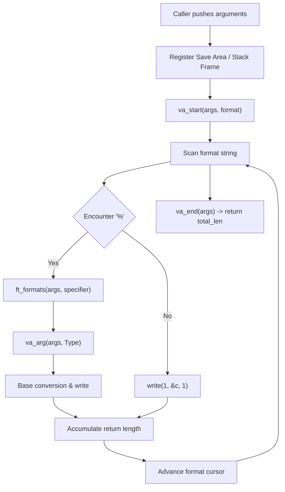

*This project has been created as part of the 42 curriculum by ahsimsek.*

# ft_printf

## Description
ft_printf is an algorithm and systems project in the 42 curriculum designed to recreate the formatted output conversion engine of the standard C library function `printf(3)`.

The project requires parsing a format control string and processing a dynamic sequence of heterogeneous arguments using C variadic argument primitives (`<stdarg.h>`). The resulting library (`libftprintf.a`) replicates standard specifier conversions, handles numeric base representations, resolves boundary conditions such as two's complement integer extremes, and tracks total byte output without dynamic memory allocations or buffered streaming.

---

## Instructions

### Compilation
The library is compiled using a standard Makefile with required compiler flags (`-Wall -Wextra -Werror`). To build `libftprintf.a`:

```bash
make
```

The Makefile compiles each `.c` source file into an object file (`.o`) and archives them into the static library `libftprintf.a` using `ar rcs`.

Available Makefile rules:
- `make all`: Builds the static library `libftprintf.a`.
- `make clean`: Removes intermediate object files (`.o`).
- `make fclean`: Removes object files and the `libftprintf.a` binary.
- `make re`: Recompiles the library from scratch.

### Usage in a C Project
Include `ft_printf.h` in your source code and link against `libftprintf.a`:

```c
#include "ft_printf.h"

int	main(void)
{
	int		printed;
	char	*user;

	user = "ahsimsek";
	printed = ft_printf("User: %s | Score: %d | Hex: %x | Pointer: %p\n",
			user, 42, 255, user);
	ft_printf("Total characters written: %d\n", printed);
	return (0);
}
```

Compile with:

```bash
cc -Wall -Wextra -Werror main.c libftprintf.a -o test_printf
./test_printf
```

---

## Conversion Specifiers

The implementation supports the following conversion specifiers matching standard `printf` behavior:

| Specifier | Argument Type | Output Format | Edge Case Behavior |
| :---: | :--- | :--- | :--- |
| `%c` | `int` (promoted) | Single ASCII character. | Handles null byte (`\0`). |
| `%s` | `char *` | Null-terminated string. | Outputs `(null)` if pointer is `NULL`. |
| `%p` | `void *` | Hexadecimal address with `0x` prefix. | Outputs `(nil)` on Linux if pointer is `NULL`. |
| `%d` | `int` | Signed base-10 decimal integer. | Handles `-2147483648` (`INT_MIN`). |
| `%i` | `int` | Signed base-10 integer. | Identical to `%d`. |
| `%u` | `unsigned int` | Unsigned base-10 integer. | Values from `0` to `4294967295`. |
| `%x` | `unsigned int` | Lowercase base-16 hexadecimal (`0123456789abcdef`). | Zero outputs `0`. |
| `%X` | `unsigned int` | Uppercase base-16 hexadecimal (`0123456789ABCDEF`). | Zero outputs `0`. |
| `%%` | None | Literal `%` character. | Consumes no variable argument. |

Return value: Returns the total number of characters written to standard output (`stdout`), or `-1` if the format string pointer is `NULL` or an output write error occurs.

---

## Algorithm and Data Structure

### 1. Variadic Arguments on the System V AMD64 ABI

In standard C, variadic functions accept an arbitrary number of parameters following fixed positional arguments. The mechanics are coordinated via `<stdarg.h>`:

- `va_list`: An opaque cursor type pointing to argument data.
- `va_start(args, format)`: Initializes the cursor immediately past the named argument `format`.
- `va_arg(args, type)`: Fetches the value at the current position, casts it to `type`, and advances the cursor based on ABI alignment rules.
- `va_end(args)`: Invalidates the cursor and cleans up stack resources.

Under the System V AMD64 ABI (x86_64 Linux), the first 6 integer or pointer arguments are passed via general-purpose registers (`%rdi`, `%rsi`, `%rdx`, `%rcx`, `%r8`, `%r9`). Variadic arguments are spilled into a contiguous register save area on the stack frame. `va_arg` retrieves data directly from this structure, maintaining type correctness and memory alignment.



---

### 2. Base Conversion Mathematics

Number printing requires converting binary integer values into textual representations across arbitrary radices (base 10 and base 16).

#### Base-10 Decimal Conversion
For a positive integer $X$, the decimal digits are computed via successive Euclidean divisions by 10:

$$X = 10 \cdot q + r \quad \text{where} \quad r = X \pmod{10}, \quad 0 \le r < 10$$

Because Euclidean division produces digits from least significant to most significant (right-to-left), recursion is used to unwind the stack in natural left-to-right printing order:

```c
int	ft_putunsigned(unsigned int n)
{
	int	len;

	len = 0;
	if (n >= 10)
		len += ft_putunsigned(n / 10);
	len += ft_putchar((n % 10) + '0');
	return (len);
}
```

The recursion depth is bounded by $\lceil \log_{10}(2^{32}) \rceil = 10$ frames, ensuring minimal stack usage.

#### Two's Complement Extremes (`INT_MIN`)
Signed 32-bit integers use two's complement representation:

$$[-2^{31}, 2^{31} - 1] = [-2147483648, 2147483647]$$

The negative range contains one more value than the positive range. Attempting to negate $-2147483648$ (`n = -n`) causes signed integer overflow, resulting in undefined behavior in C.

`ft_printf` resolves this boundary condition with an explicit guard:

```c
if (n == -2147483648)
{
	write(1, "-2147483648", 11);
	return (11);
}
```

#### Base-16 Hexadecimal and Pointer Encoding
For an unsigned integer or pointer address $P$, conversion uses radix 16:

$$P = 16 \cdot q + r \quad \text{where} \quad r = P \pmod{16}, \quad 0 \le r < 16$$

The remainder $r$ maps directly to a character lookup table:
- Lowercase (`%x`): `"0123456789abcdef"[r]`
- Uppercase (`%X`): `"0123456789ABCDEF"[r]`

For `%p`, the argument is received as `void *`, cast to `unsigned long` to guarantee 64-bit width preservation on 64-bit architectures, prepended with `"0x"`, and printed via `ft_puthex_ptr`. If the pointer is `NULL`, the function outputs `(nil)`.

---

### 3. Complexity Analysis

| Operation | Time Complexity | Auxiliary Space Complexity | Recursion Depth |
| :--- | :---: | :---: | :---: |
| **Literal Text Parsing** | $\mathcal{O}(L)$ | $\mathcal{O}(1)$ | 0 |
| **Character (`%c`)** | $\mathcal{O}(1)$ | $\mathcal{O}(1)$ | 0 |
| **String (`%s`)** | $\mathcal{O}(K)$ | $\mathcal{O}(1)$ | 0 |
| **Signed Integer (`%d`, `%i`)** | $\mathcal{O}(\log_{10} N)$ | $\mathcal{O}(1)$ | $\le 10$ frames |
| **Unsigned Integer (`%u`)** | $\mathcal{O}(\log_{10} N)$ | $\mathcal{O}(1)$ | $\le 10$ frames |
| **Hexadecimal (`%x`, `%X`)** | $\mathcal{O}(\log_{16} N)$ | $\mathcal{O}(1)$ | $\le 8$ frames |
| **Pointer (`%p`)** | $\mathcal{O}(\log_{16} P)$ | $\mathcal{O}(1)$ | $\le 16$ frames |

Here, $L$ represents format string length, $K$ represents string argument length, $N$ represents a 32-bit integer magnitude, and $P$ represents a 64-bit memory address. The auxiliary space complexity is strictly $\mathcal{O}(1)$ because no dynamic heap allocations (`malloc`) are performed.

---

## Resources

### Classic References
- **Stevens, W. Richard, and Stephen A. Rago.** *Advanced Programming in the UNIX Environment* (3rd Edition). Addison-Wesley, 2013. Chapter 3: File I/O.
- **System V Application Binary Interface:** AMD64 Architecture Processor Supplement (Draft Version 0.99.6).
- **Linux Programmer's Manual:** `man 3 printf`, `man 3 stdarg`.

### AI Usage
- **ABI Clarification:** AI tools were used during research to verify register allocation behavior for variadic argument frames under System V AMD64 specifications.
- **Implementation & Validation:** Parsing logic, base conversion recursions, format dispatchers, and Makefile configurations were independently implemented by the author, and validated using external testing suites (`printfTester`, `ft_printf_tester`) with zero leaks and full Norminette compliance.

---

*This README was written with the assistance of AI.*
