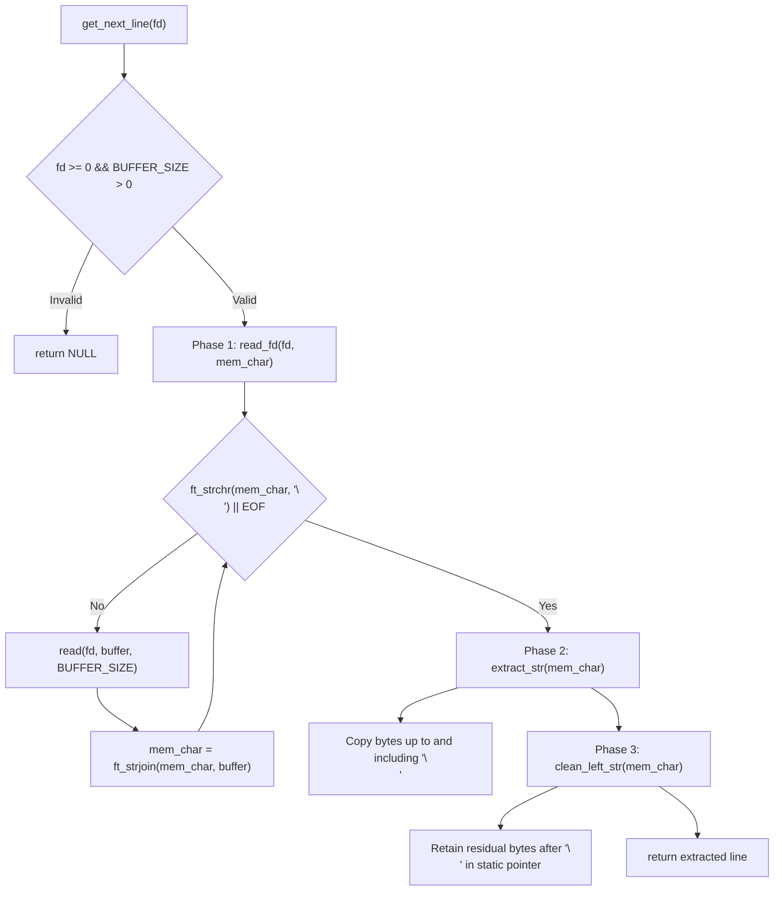

*This project has been created as part of the 42 curriculum by ahsimsek.*

# get_next_line

## Description
get_next_line is a core systems programming project in the 42 curriculum. The goal is to implement a robust, leak-free C function that reads and returns an individual line from a given file descriptor (`fd`) on each invocation until the end of the file (EOF) is reached.

The function prototype is:
```c
char	*get_next_line(int fd);
```

Each returned line includes the terminating newline character (`\n`) if one was encountered prior to EOF. When reading completes or when an error occurs (such as an invalid file descriptor or allocation failure), the function returns `NULL`. The read buffer size is decoupled from source code and injected at compilation time via the `-D BUFFER_SIZE=n` preprocessor directive, accommodating arbitrary buffer lengths from 1 byte to several megabytes.

---

## Instructions

### Compilation
Compile `get_next_line` alongside your source files with mandatory compiler flags (`-Wall -Wextra -Werror`) and specify `BUFFER_SIZE`:

```bash
cc -Wall -Wextra -Werror -D BUFFER_SIZE=42 get_next_line.c get_next_line_utils.c main.c -o gnl
```

If no `BUFFER_SIZE` flag is passed, `get_next_line.h` provides a default fallback of `42`.

### Usage in a C Project
Include `get_next_line.h` and read from any valid file descriptor in a sequential loop:

```c
#include "get_next_line.h"
#include <fcntl.h>
#include <stdio.h>

int	main(void)
{
	int		fd;
	char	*line;

	fd = open("sample.txt", O_RDONLY);
	if (fd < 0)
		return (1);
	line = get_next_line(fd);
	while (line != NULL)
	{
		printf("%s", line);
		free(line);
		line = get_next_line(fd);
	}
	close(fd);
	return (0);
}
```

Compile and run:
```bash
cc -Wall -Wextra -Werror -D BUFFER_SIZE=32 main.c get_next_line.c get_next_line_utils.c -o test_gnl
./test_gnl
```

### Multiple File Descriptors (Bonus)
The bonus implementation supports reading concurrently from multiple open file descriptors without losing the reading context of any stream. It indexes persistent buffer pointers inside a static array sized to the system limit (`OPEN_MAX`):

```bash
cc -Wall -Wextra -Werror -D BUFFER_SIZE=64 get_next_line_bonus.c get_next_line_utils_bonus.c main_bonus.c -o test_bonus
```

---

## Algorithm and Data Structure

### 1. Persistent State in the BSS/Data Segment

Because file input is consumed in chunks of `BUFFER_SIZE` bytes, a single `read(2)` call often ingests characters that extend beyond the next newline delimiter (`\n`). In standard C runtime architectures:

- **Stack Frames:** Local variables allocated inside `get_next_line()` are destroyed upon function return.
- **BSS/Data Segment:** Static variables (`static char *mem_char`) reside in the program's static data segment. Their lifetime spans the entire program duration, preserving unreturned characters between consecutive function calls.

```text
Memory Layout of Stream Buffer Persistence:

Call 1 Read Chunks: [ Line 1 Content \n | Leftover Content ... ]
                          │                       │
                          ▼                       ▼
                   Returned to Caller      Saved in static mem_char

Call 2 Begins:      Uses static mem_char as initial input before reading fd again
```

---

### 2. The Three-Phase Pipeline

`get_next_line` orchestrates stream processing through three distinct stages:



#### Phase 1: Stream Ingestion and Accumulation (`read_fd`)
The helper allocates a heap buffer of size `BUFFER_SIZE + 1`. It repeatedly calls `read(fd, buffer, BUFFER_SIZE)` until a newline character is located in the accumulated string or EOF (`read() == 0`) is reached. Each read chunk is appended to `mem_char` using `ft_strjoin`, which frees the previous allocation to prevent memory leaks.

#### Phase 2: Line Extraction (`extract_str`)
Once a newline is present or EOF is reached, `extract_str` computes the byte length of the line up to and including the first `\n`. It allocates exact heap memory for this line, copies the characters, appends a null terminator (`\0`), and returns the pointer to the caller.

#### Phase 3: Remainder Cleanup (`clean_left_str`)
The remaining characters situated after the newline are extracted into a newly allocated buffer and assigned back to `mem_char`. The old accumulator string is freed. If no characters remain, `mem_char` is freed and set to `NULL`, ensuring that no allocated memory lingers once a file is fully read.

---

### 3. Buffer Sizing and Complexity Analysis

Let $L$ denote the byte length of the line being read, and let $B$ denote the compile-time `BUFFER_SIZE`.

#### System Call Frequency
The number of `read(2)` system calls $S$ required to assemble a line is given by:

$$S = \left\lceil \frac{L}{B} \right\rceil$$

- **Small Buffer ($B = 1$):** Exactly $L$ system calls are executed per line. While memory overhead per call is minimal, repeated kernel-to-user space context switches degrade performance.
- **Optimal Buffer ($B \approx 4096$):** Aligns with standard operating system memory page sizes, minimizing context switches while keeping memory usage modest.
- **Large Buffer ($B \ge 10^6$):** A single system call captures the line, but allocates a large heap buffer that remains mostly unused if lines are short.

#### Complexity Summary

| Dimension | Metric | Justification |
| :--- | :---: | :--- |
| **Time Complexity** | $\mathcal{O}(L)$ | Each byte in the returned line is read and copied a constant number of times. |
| **Auxiliary Heap Space** | $\mathcal{O}(B + L)$ | Buffer allocation of size $B + 1$ plus accumulator growth proportional to $L$. |
| **Static Memory Usage** | $\mathcal{O}(1)$ | Single pointer (`sizeof(char *)`) in mandatory; array of size `OPEN_MAX` in bonus. |

---

### 4. Memory Safety & Edge Conditions

The implementation implements defensive guards against common C memory pitfalls:

- **Invalid File Descriptors:** Validated at the function entry point (`fd < 0 || BUFFER_SIZE <= 0`).
- **Read Error Recovery:** If `read()` returns `-1` (for example, if the descriptor is a directory or disconnected pipe), both the temporary chunk buffer and the persistent static string are immediately deallocated, preventing orphaned allocations.
- **Clean EOF Teardown:** When the final line of a file lacks a trailing newline, `extract_str` returns the remaining text. The subsequent call detects an empty residual string, cleans up the static pointer to `NULL`, and returns `NULL`.

---

## Resources

### Classic References
- **Stevens, W. Richard, and Stephen A. Rago.** *Advanced Programming in the UNIX Environment* (3rd Edition). Addison-Wesley, 2013. Chapter 3: File Descriptors, File Sharing, and I/O Efficiency.
- **Kernighan, Brian W., and Dennis M. Ritchie.** *The C Programming Language* (2nd Edition). Section 8.2: Low Level I/O (Read and Write).
- **Linux Programmer's Manual:** `man 2 read`, `man 2 open`.

### AI Usage
- **Kernel I/O Semantics:** AI tools were consulted during research to clarify POSIX file table offset behaviors across concurrent file descriptors.
- **Code & Implementation:** Accumulation logic, buffer concatenation primitives, memory cleanup sequences, and bonus array indexing were independently written, structured, and validated by the author, and verified against `gnlTester` and `42cursus-gnl-tests` with zero leaks under Valgrind.

---

*This README was written with the assistance of AI.*
