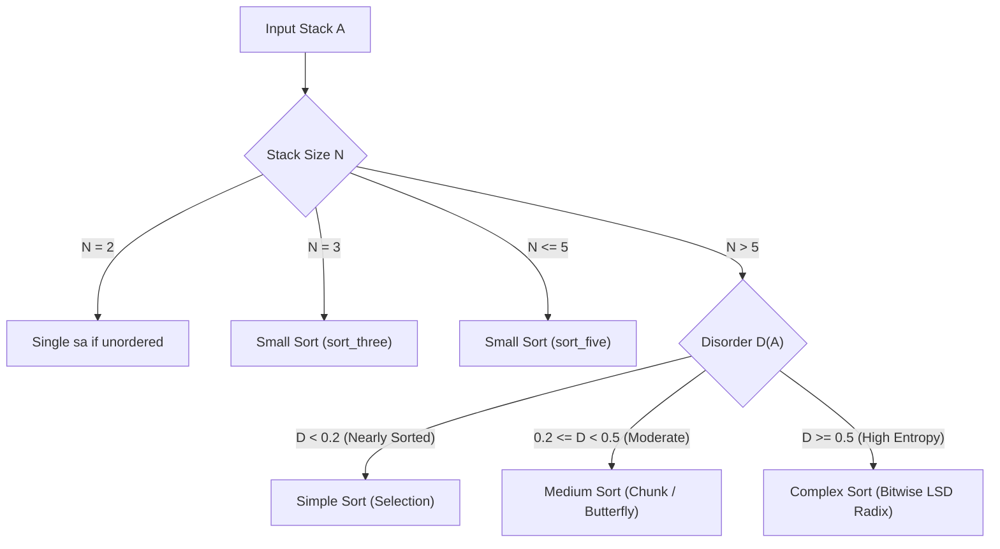

*This project has been created as part of the 42 curriculum by ahsimsek.*

# push_swap

## Description
**push_swap** is an algorithmic systems project in the 42 curriculum designed to explore sorting algorithms, algorithmic complexity, stack data structures, and optimization heuristics under stringent instruction constraints.

The objective is to sort a set of integer values on a stack using a secondary helper stack and a strictly limited set of stack manipulation instructions, minimizing the total number of operations performed.

The project operates with two stacks, **Stack A** and **Stack B**:
- **Stack A:** Initially populated with a random, unorganized sequence of positive and/or negative non-duplicate integers.
- **Stack B:** Initially empty, used as an auxiliary memory buffer during sorting.
- **End Condition:** All numbers must be sorted in ascending order inside **Stack A**, and **Stack B** must be completely empty.

---

## Instructions

### Compilation
The project is built using a standard `Makefile` with mandatory compiler flags (`-Wall -Wextra -Werror`). To build the binary:

```bash
make
```

The Makefile compiles all source files, builds and links the internal `libft` static library (`libft/libft.a`), and outputs the `push_swap` binary at the root of the project directory.

Available Makefile rules:
- `make clean`: Deletes intermediate object files (`.o`).
- `make fclean`: Cleans all object files, `libft.a`, and the `push_swap` executable.
- `make re`: Recompiles the entire project from scratch.

### Execution
Run `push_swap` by passing integer arguments directly or as a formatted, space-separated string:

```bash
# Direct arguments
./push_swap 2 1 3 6 5 8

# Quoted string argument
./push_swap "2 1 3 6 5 8"
```

To verify the validity of the generated operations using the 42 `checker` binary:

```bash
ARG="4 67 3 87 23"; ./push_swap $ARG | ./checker_linux $ARG
```

If the instructions sort Stack A in ascending order without errors, the checker displays `OK`.

### Benchmark Mode (`--bench`)
The program includes an internal benchmarking and telemetry module accessible via the `--bench` flag. When enabled, benchmark diagnostics are written to standard error (`stderr`, fd 2), including initial disorder percentage, chosen sorting strategy, theoretical complexity, total operation counts, and a granular instruction breakdown:

```bash
./push_swap --bench 4 67 3 87 23
```

Example diagnostic output:
```text
[bench] Disorder: 40.00%
[bench] Strategy: Adaptive -> Medium Sort (O(n*sqrt(n)))
[bench] Total operations: 14
[bench] sa: 0, sb: 0, ss: 0
[bench] pa: 2, pb: 2
[bench] ra: 5, rb: 2, rr: 0
[bench] rra: 3, rrb: 0, rrr: 0
```

### Instruction Set

| Operation | Opcode | Description |
| :---: | :---: | :--- |
| **Swap** | `sa` | Swaps the first 2 elements at the top of Stack A. Does nothing if there is only 1 or no elements. |
| | `sb` | Swaps the first 2 elements at the top of Stack B. Does nothing if there is only 1 or no elements. |
| | `ss` | Executes `sa` and `sb` simultaneously. |
| **Push** | `pa` | Takes the top element of Stack B and pushes it onto Stack A. Does nothing if Stack B is empty. |
| | `pb` | Takes the top element of Stack A and pushes it onto Stack B. Does nothing if Stack A is empty. |
| **Rotate** | `ra` | Shifts all elements of Stack A up by 1 position. The first element becomes the last element. |
| | `rb` | Shifts all elements of Stack B up by 1 position. The first element becomes the last element. |
| | `rr` | Executes `ra` and `rb` simultaneously. |
| **Reverse Rotate** | `rra` | Shifts all elements of Stack A down by 1 position. The last element becomes the first element. |
| | `rrb` | Shifts all elements of Stack B down by 1 position. The last element becomes the first element. |
| | `rrr` | Executes `rra` and `rrb` simultaneously. |

---

## The Disorder Metric (Entropy Analysis)

### Theoretical Background & Mathematical Derivation
In order to determine the most cost-effective sorting strategy without blindly assuming a static distribution, `push_swap` computes the **Normalized Inversion Count** (Disorder Metric) of the input before dispatching.

In combinatorial mathematics and information theory, the "unsortedness" or entropy of a sequence $A = (a_1, a_2, \dots, a_N)$ is defined by the number of **inversions** (pairs out of order). An inversion pair $(i, j)$ occurs whenever:

$$i < j \quad \text{and} \quad a_i > a_j$$

For a sequence of $N$ distinct elements, the total number of distinct index pairs $(i, j)$ is given by the binomial coefficient:

$$\text{Total Pairs} = \binom{N}{2} = \frac{N(N - 1)}{2}$$

The **Disorder Metric** $D(A)$ is defined as the ratio of observed inversions (mistakes) to the maximum possible inversions:

$$D(A) = \frac{\text{Mistakes}}{\text{Total Pairs}} = \frac{\sum_{i=1}^{N-1} \sum_{j=i+1}^N \mathbf{1}_{\{a_i > a_j\}}}{\frac{N(N - 1)}{2}} = \frac{2 \cdot \text{Mistakes}}{N(N - 1)}$$

### Boundary Properties & Scale:
- **$D(A) = 0.0$ ($0.00\%$):** Strict ascending order. Stack is completely sorted. Zero operations required.
- **$0.0 < D(A) < 0.2$ ($< 20\%$):** Nearly sorted array with local disruptions.
- **$0.2 \le D(A) < 0.5$ ($20\% - 50\%$):** Partially disordered array with moderate entropy.
- **$D(A) \ge 0.5$ ($\ge 50\%$):** High entropy or adversarial permutation.
- **$D(A) = 1.0$ ($100.00\%$):** Strict descending order (worst-case reverse sorted permutation, where every pair is inverted: $\text{Mistakes} = \frac{N(N-1)}{2}$).

In `disorder.c`, this metric is calculated in a single nested pass:
```c
double	compute_disorder(t_stack *a)
{
	t_stack	*i_node;
	t_stack	*j_node;
	long	mistakes;
	long	total_pairs;

	if (!a || !a->next)
		return (0.0);
	mistakes = 0;
	total_pairs = 0;
	i_node = a;
	while (i_node)
	{
		j_node = i_node->next;
		while (j_node)
		{
			total_pairs++;
			if (i_node->value > j_node->value)
				mistakes++;
			j_node = j_node->next;
		}
		i_node = i_node->next;
	}
	if (total_pairs == 0)
		return (0.0);
	return ((double)mistakes / (double)total_pairs);
}
```

---

## Sorting Algorithms & Architecture

The sorting engine adopts a **hybrid adaptive architecture** implemented in `sort_dispatcher.c`. Instead of applying a rigid algorithm to every dataset, the dispatcher analyzes stack size $N$ and the disorder metric $D(A)$ to dynamically select the optimal algorithm:



---

### 1. Data Normalization: Index Compression (`index.c`)
Before complex sorting, input values are transformed into rank indices via `assign_index()`. Each integer is mapped to its relative position in the range $[0, N - 1]$:
- Value comparison is performed across all elements in $\mathcal{O}(N^2)$ time.
- For each node, `index` counts how many elements in the stack are strictly smaller than itself.
- **Advantage:** Index compression allows bitwise arithmetic and chunk boundaries to operate on compact, positive $[0, N-1]$ integers regardless of negative values, large gaps, or `INT_MIN`/`INT_MAX` extremes.

---

### 2. Small Sort Engine (`small_sort.c`)
Designed specifically for small inputs where asymptotic behavior does not matter and every single operation must be hard-minimized:

#### Size 2:
- If $a[0] > a[1]$, execute `sa`. Total: $1$ operation.

#### Size 3 (`sort_three`):
- For $N = 3$, there are $3! = 6$ possible permutations. Excluding the sorted case, the 5 permutations are resolved in at most 2 operations via state evaluation:
  1. `[2, 1, 3]` $\to$ `sa` (1 op)
  2. `[3, 2, 1]` $\to$ `sa` + `rra` (2 ops)
  3. `[3, 1, 2]` $\to$ `ra` (1 op)
  4. `[1, 3, 2]` $\to$ `sa` + `ra` (2 ops)
  5. `[2, 3, 1]` $\to$ `rra` (1 op)

#### Size 4 and 5 (`sort_five`):
- Locates the minimum node in Stack A using `find_min_node(*a)`.
- Calculates shortest rotation path using node position:
  - If $\text{pos} \le \frac{\text{size}}{2}$, rotates upward via `ra`.
  - If $\text{pos} > \frac{\text{size}}{2}$, rotates downward via `rra`.
- Pushes the minimum to Stack B (`pb`).
- Repeated until exactly 3 elements remain in Stack A.
- Executes `sort_three()` on the remaining 3 elements.
- Pushes the extracted minimums back to Stack A (`pa`).
- Total operations: strictly $\le 12$ operations for $N = 5$.

---

### 3. Simple Sort: Selection-Based Extraction (`simple_sort.c`)
- **Target Domain:** Triggered when $D(A) < 0.2$ (nearly sorted data).
- **Complexity:** $\mathcal{O}(N^2)$ time complexity.
- **Mechanism:**
  - Successively extracts the smallest element of Stack A by computing the shortest rotational distance (`ra` vs `rra`).
  - Pushes each minimum onto Stack B (`pb`) until only 3 elements remain in Stack A.
  - Resolves the 3 elements with `sort_three(a)`.
  - Pours Stack B back into Stack A (`pa`).
- **Why it is optimal for low disorder:** When an array is nearly sorted, elements are already close to their target positions. Finding and rotating minimum elements takes significantly fewer operations than full bitwise distribution or chunking passes.

---

### 4. Medium Sort: Adaptive Chunk / Butterfly Sort (`medium_sort.c`)
- **Target Domain:** Triggered when $0.2 \le D(A) < 0.5$ or for $N \le 100$.
- **Complexity:** $\mathcal{O}(N \sqrt{N})$ time complexity.
- **Dynamic Chunk Sizing:**
  The window chunk size is dynamically calibrated using square root scaling:
  $$\text{chunk} = \max\left(1, \left\lfloor \frac{\sqrt{N} \cdot 145}{100} \right\rfloor\right) \approx 1.45 \cdot \sqrt{N}$$
  *(For $N = 100$, chunk size is $\sim 14$ elements).*

#### Phase A: Butterfly Push to Stack B (`push_chunks_to_b`)
Maintains a moving index window $[pushed, pushed + chunk]$:
1. If top element's index satisfies $\text{index} \le pushed$:
   - Pushes to Stack B (`pb`).
   - Immediately rotates Stack B (`rb`).
   - *Effect:* Smaller elements sink to the **bottom** of Stack B.
2. Else if top element's index satisfies $\text{index} \le pushed + chunk$:
   - Pushes to Stack B (`pb`) without rotation.
   - *Effect:* Intermediate elements remain at the **top** of Stack B.
3. Else:
   - Rotates Stack A (`ra`) to hunt for valid candidates within the current window.
   - Increment `pushed` as elements are absorbed.

*Result:* Stack B forms a symmetric **hourglass / butterfly structure** where values are clustered bi-directionally (smallest at bottom, medium in middle, largest at top).

#### Phase B: Greedy Maximum Retrieval (`push_back_to_a`)
- Continuously locates `find_max_node(*b)` in Stack B.
- Rotates Stack B via the shortest path:
  - If $\text{pos} \le \frac{\text{size}}{2} \implies$ `rb`
  - If $\text{pos} > \frac{\text{size}}{2} \implies$ `rrb`
- Pushes the maximum back to Stack A (`pa`).
- Due to the butterfly distribution, maximum elements are always located at or near the extremes of Stack B, requiring minimal rotation overhead.

---

### 5. Complex Sort: Bitwise LSD Radix Sort (`radix_sort.c`)
- **Target Domain:** Triggered when $D(A) \ge 0.5$ (high chaos / reversed) or for massive datasets ($N \ge 500$).
- **Complexity:** $\mathcal{O}(k \cdot N) = \mathcal{O}(N \log_2 N)$ time complexity, where $k = \lceil \log_2 N \rceil$.
- **Mechanism:**
  - Operates on the indexed representations $[0, N - 1]$.
  - Determines the maximum bit count $k = \text{get\_max\_bits}(N - 1)$.
  - For each bit position $i \in [0, k - 1]$:
    1. Iterates over all $N$ elements in Stack A:
       - Inspects the $i$-th bit of the top element: `(index >> i) & 1`.
       - If bit is `1`: Rotates Stack A (`ra`) to keep the element in Stack A.
       - If bit is `0`: Pushes the element to Stack B (`pb`).
    2. Once all $N$ elements are processed for bit $i$, pushes all elements back from Stack B to Stack A (`pa`).
- **Guaranteed Bounds:** Radix Sort provides deterministic operation counts regardless of input entropy or worst-case adversarial data patterns.

---

## Resources

### Classic References
- **Knuth, Donald E.** *The Art of Computer Programming, Volume 3: Sorting and Searching* (Section 5.2.5: Sorting by Distribution).
- **Kendall, Maurice G.** (1938). *A New Measure of Rank Correlation* (Foundations of Kendall tau distance and inversion metrics).
- **Cormen, T. H., Leiserson, C. E., Rivest, R. L., & Stein, C.** *Introduction to Algorithms* (Radix Sort & Permutation Networks).

### AI Usage
- **Conceptual Clarification:** AI tools were used to research permutation inversion formulas, formalize the Kendall tau disorder metric, and calculate optimal chunk ratios ($1.45 \cdot \sqrt{N}$) for two-stack butterfly distributions.
- **Code & Implementation:** All stack primitives, memory management, sorting implementations, and benchmark diagnostics were implemented, validated, and debugged independently by the author to ensure strict 42 Norminette compliance and zero memory leaks.

---

*This README was written with the assistance of AI.*
